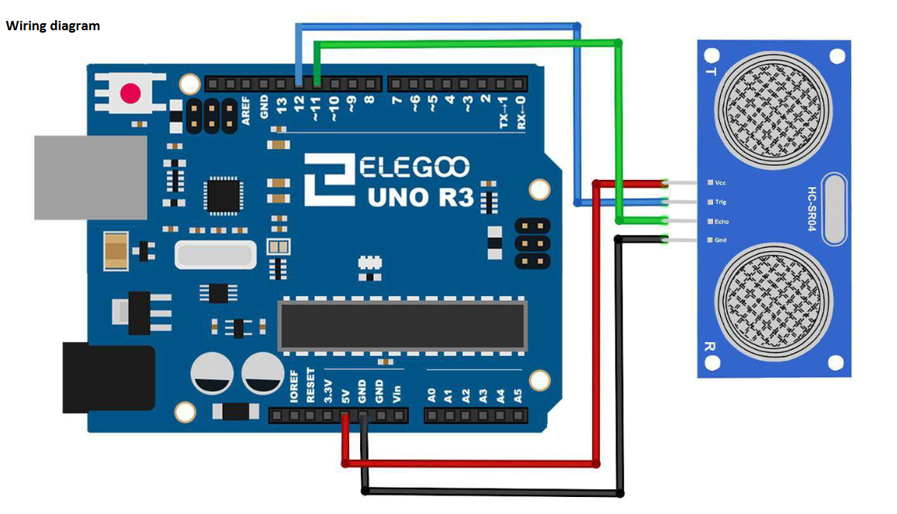
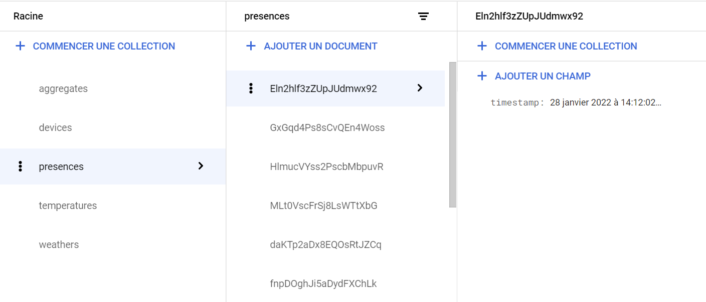
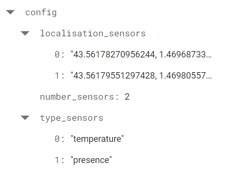
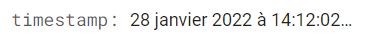
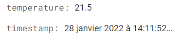
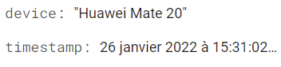
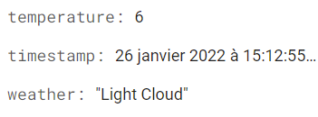

# multi-sensor-network

The goal of this project is to develop a system to collect and monitor a bunch of sensors' data in a building.

--------------------
## Architecture
--------------------

The center of the project is the UPSSITECH_slot which is able to :
- receive the data collected by the sensors
- store the data
- send the data to be consulted on the dashboard

The dashboard is the interface between the user and the system. It displays recent data.

Sensors can be of two types, either field or virtual. Field sensors are real [Arduino](https://www.arduino.cc/) sensors whereas virtual sensors are simulated with API.  
Field sensors are connected through USB ports to an aggregate which stores the data locally and send it to the slot.  
Virtual sensors send data directly to the slot.

--------------------
## Solutions
--------------------
### **UPSSITECH_slot**
The UPSSITECH_slot is an API developped in Python with the [Flask](https://en.wikipedia.org/wiki/Flask_(web_framework)) framework. It is deployed on [Google Cloud Platform](https://en.wikipedia.org/wiki/Google_Cloud_Platform). To store the data, a [Cloud Firestore](https://firebase.google.com/products/firestore) database is used. The slot interacts with the database through the Firestore API.

List of the endpoints :

  
click to see

  
- https://multi-sensor-network-api.ew.r.appspot.com/temperatures
- https://multi-sensor-network-api.ew.r.appspot.com/devices
- https://multi-sensor-network-api.ew.r.appspot.com/weathers
- https://multi-sensor-network-api.ew.r.appspot.com/presences
- https://multi-sensor-network-api.ew.r.appspot.com/aggregates

### **Aggregate_1**

Aggregate1 collects data from two field sensors through serial ports and locally saves it. On a regular basis, it does POST request to the slot API to send data into the cloud.

A .json file [(here)](./aggregate_1_config.json) is associated to the aggregate and contains some info about its configuration. When the aggregate starts, it sends this config to the slot API using a POST request.

#### **Field_sensor_1**
Component Required:
- (1) x Elegoo Uno R3
- (1) x Ultrasonic sensor module
- (4) x F-M wires (Female to Male DuPont wir

The uno sends the distance between the ultrasonic sensor and the first object in front of it every 15ms.
If the distance suddenly reduces, it means that something is in front of the sensor then the timestamp is saved in the aggregate.

#### **Field_sensor_2**

Material was missing to do it with arduino so a fake temperature is regularly saved in the aggregate. After some time, the aggregate calculates the average of all locally saved values ​​and sends the result to the slot with a timestamp.

### **Virtual Sensors**

A virtual sensor is just a script that regularly does a GET request to an external API to obtain a data and then sends it through a POST request directly to the slot with a timestamp. 

#### **Virtual_sensor_1**

This virtual sensor aims to get the weather around UPSSITECH (so the weather in Toulouse). Weather is represented with a temperature and a small description such as "sunny" or "light rain".

Data come from [metaweather API](https://www.metaweather.com/api/location/628886/)

#### **Virtual_sensor_2**

This virtual sensor aim is to fake observing connections to the UPSSITECH wifi network. A connection is represented by a device model and a timestamp reflecting the datetime when the device has been connected.

Data come from [random data API](https://random-data-api.com/api/device/random_device)

#### **The dashboard**

As you can get data from the API (see the endpoints list), if you have front-end skills you can code your own dashboard. In this project, the Firestore dashboard is used.

A Firestore database is made up of collections of documents containing key-value data. For example, it can be a collection "data" which contains the document "presences" that contains all data. But Firestore and its query system is optimised to have a big quantity of small documents and not a small quantity of long documents. So here is how the database of this project looks like :

- left : 5 collections, each one represents a type of data collected.
- center : documents in the collection selected, names are automatically defined by Firestore because it doesn't matter here
- right : content of the document selected

Exemple of content for each type of data :

- aggregates :   

- presences :   

- temperatures :   

- devices :   

- weathers :   

Firestore allows you to sort the list of documents according to a chosen field. With the timestamp field in each data, you can sort in descending chronological order so that the latest data appears at the top.

--------------------
## Launch
--------------------
- you don't need to do anything to launch the slot as long as it is running on the cloud
- set up the arduino assembly following the diagram and plug it to one of your USB port
- upload presence_sensor.ino [(here)](./sensors/presence_sensor/presence_sensor.ino) to your Arduino Uno
- don't forget to close the Arduino IDE, otherwise it will prevent aggregate1 from using the USB port
- launch aggregate_1.py [(here)](aggregate_1.py) and choose the port used by your arduino

At this point aggregate1 is running, it collects data everytime a presence is detected and a fake temperature is collected every second.   
By defaut every 20 seconds, local data is sent to the slot.

- launch device_virtual_sensor_2.py [(here)](.\sensors\device_virtual_sensor_2.py) to start the fake device sensor
- launch weather_virtual_sensor_1.py [(here)](.\sensors\weather_virtual_sensor_1.py) to start the fake weather sensor

Both of them send data to the slot once every 10-20 seconds approximately.

----

For the "dashboard", if you have direct access to the firestore database, just connect. Otherwise, visit these endpoints that allow you to see the 10 more recent (in term of timestamp in the data) data : 
- https://multi-sensor-network-api.ew.r.appspot.com/temperatures
- https://multi-sensor-network-api.ew.r.appspot.com/devices
- https://multi-sensor-network-api.ew.r.appspot.com/weathers
- https://multi-sensor-network-api.ew.r.appspot.com/presences

Finally, this endpoint gives you the configurations of the aggregates connected to the slot :
- https://multi-sensor-network-api.ew.r.appspot.com/aggregates