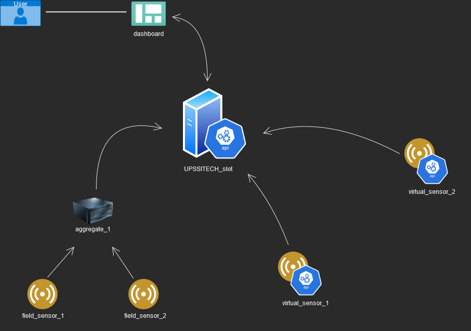

# multi-sensor-network

The goal of this project is to develop a system to collect and monitor a bunch of sensors' data in a building.

--------------------
## Architecture
--------------------

The center of the project is the UPSSITECH_slot which is able to :
- receive the data collected by the sensors
- store the data
- send the data to be consulted on the dashboard

The dashboard is the interface between the user and the system. It displays recent data.

Sensors can be of two types, either field or virtual. Field sensors are real [Arduino](https://www.arduino.cc/) sensors whereas virtual sensors are simulated with API.  
Field sensors are connected through USB ports to an aggregate which stores the data locally and send it to the slot.  
Virtual sensors send data directly to the slot.

--------------------
## Solutions
--------------------
- The UPSSITECH_slot is an API developped in Python with the [Flask](https://en.wikipedia.org/wiki/Flask_(web_framework)) framework. It is deployed on [Google Cloud Platform](https://en.wikipedia.org/wiki/Google_Cloud_Platform). To store the data, a [Cloud Firestore](https://firebase.google.com/products/firestore) database is used. The slot interacts with the database through the Firestore API.  

- Aggregate_1 :
  - Field_sensor_1 : TODO
  - Field_sensor_2 : TODO  
  TODO aggregate
  
- Virtual_sensor_1 : TODO
- Virtual_sensor_2 : TODO
- The dashboard : TODO